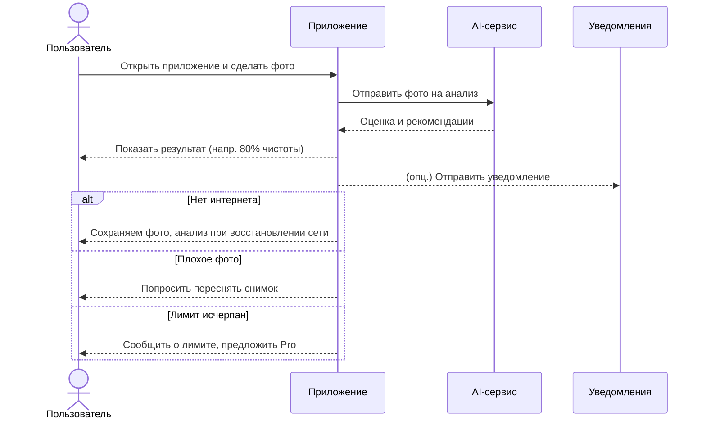

# D2 — Use‑case Narrative

Детальное описание сценариев использования приложения.

---

## Оглавление

- [Обзор](#обзор)
- [Акторы](#акторы)
- [Предусловия](#предусловия)
- [Основной сценарий (Happy Path)](#основной-сценарий-happy-path)
- [Альтернативные сценарии](#альтернативные-сценарии)
- [Обработка ошибок](#обработка-ошибок)
- [Постусловия](#постусловия)
- [Use-case UML](#use-case-uml)

---

## Обзор

`Cleaning Assistant` позволяет пользователю оценить качество уборки по фотографии и получить рекомендации по улучшению.

- User Value: экономия времени; отсутствие необходимости проверять всё вручную.

## Акторы

- Пользователь
- Приложение
- AI‑сервис
- Система уведомлений (опционально)

## Предусловия

- Приложение установлено, пользователь имеет доступ к камере
- Разрешения на съемку и загрузку фото предоставлены
- Есть подключение к интернету (для онлайн‑анализа)

## Основной сценарий (Happy Path)

Use‑case: Проверка уборки

1. Пользователь открывает приложение.
2. Делает фото убранной комнаты.
3. Приложение отправляет фото в AI‑сервис для анализа.
4. AI возвращает оценку и рекомендации.
5. Приложение показывает результат (например: «80% чистоты») и подсказки, что улучшить.
6. Пользователь видит, что уборка прошла успешно.

## Альтернативные сценарии

1. Нет интернета → фото сохраняется локально → анализ запускается при восстановлении соединения.
2. Плохое качество фото → приложение просит переснять снимок.
3. Несколько комнат → пользователь загружает 2+ фото → система формирует общий отчёт.

## Обработка ошибок

- Технический сбой сервера → приложение уведомляет: «Ошибка сервера. Попробуйте позже.»
- Некорректный ввод (не фото комнаты, а селфи) → сообщение: «Фото не соответствует уборке, загрузите снова.»
- Превышение лимита загрузок (например, бесплатный тариф) → уведомление о лимите + предложение тарифа Pro.

## Постусловия

- Результат оценки сохранён в профиле пользователя
- Отчёт доступен для повторного просмотра/демонстрации клиенту

## Use-case UML

